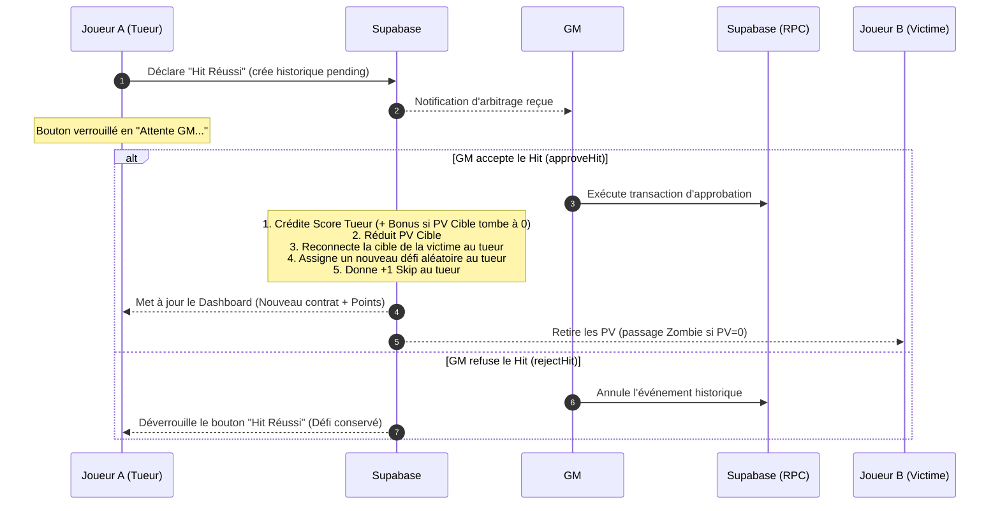
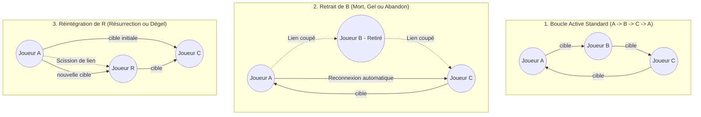

# 📘 CAHIER DES CHARGES TECHNIQUE & FONCTIONNEL : COOKILLERS (V2)

Ce document consigne les spécifications fonctionnelles détaillées, les traitements de données, les règles de gestion, les comportements du système et l'ergonomie de l'application **Cookillers (V2)**, successeur de *Festi-Killer*. Il intègre la charte lexicale sans redondance textuelle, le ton sarcastique/perché de la DA, les cycles de vie de la partie, les droits du GM, les pop-ups de Game Feel, la file d'attente offline, les nouveaux trophées et la configuration technique complète.

---

## 🎯 1. CONCEPT & OBJECTIFS DE LA V2

**Cookillers** est un jeu d'assassinat secret, de paranoïa et de bluff en temps réel conçu pour animer un festival de musique. Chaque participant se voit attribuer une cible secrète et un défi absurde à lui faire accomplir.

La V2 vise à :
1. **Épurer radicalement l'interface** : Remplacer les éléments visuels trop rigides, les contours néons épais et les doubles étiquetages par un design minimaliste, des contrastes doux et une mise en page aérée (thème sombre premium).
2. **Éliminer les répétitions textuelles (Règle d'Iconographie Stricte)** : Remplacer systématiquement les mots par leurs icônes dédiées. Si un élément est illustré par un picto ou un logo, **aucun texte descriptif n'est toléré à côté** (ex: afficher `150 🪙` au lieu de `150 points` ou `150 🪙 pts`).
3. **Fluidifier les interactions** : Permettre des actions rapides sur le terrain (temps d'attention < 10s) via des boutons larges, des fenêtres de dialogue simplifiées et un pavé numérique virtuel intégré.
4. **Sécuriser la logique de jeu** : Déporter la gestion de la boucle de cibles et les arbitrages critiques dans des transactions de base de données (SQL RPC) pour éviter toute rupture de boucle en cas de perte de réseau.
5. **Optimiser les performances** : Réduire le trafic réseau de 75 % en regroupant les requêtes et en simplifiant les abonnements de synchronisation temps réel.
6. **Maximiser le Game Feel & l'Immersion** : Introduire des cinématiques de transition d'état, des effets de vibration tactile (haptic feedback) et des pop-ups interactives amusantes et sarcastiques.
7. **Injecter un ton piquant et loufoque** : Écrire tous les commentaires, titres, alertes et descriptions de niveaux dans un ton humoristique, légèrement perché et désinvolte (ambiance *Happy Tree Friends* / *Outer Wilds* délirant).

---

## 📖 2. LEXIQUE COMMUN & STRICT (ZÉRO TEXTE REDONDANT)

Afin d'unifier la communication visuelle et technique, les termes anglais, techniques ou redondants sont formellement proscrits au profit d'un lexique commun strict. De plus, pour alléger l'interface, **chaque objet représenté par une icône ou un logo ne doit pas être écrit en toutes lettres à côté**.

### 2.1. Tableau d'Équivalence & Interdictions

| Élément | Icône / Logo | Terme Autorisé (si mention écrite nécessaire) | Termes Interdits & Proscrits (anglicismes, technique) | Règle d'Affichage Graphique Stricte |
| :--- | :---: | :--- | :--- | :--- |
| **Santé du joueur** | `❤️` | **Cœurs** (ou Vitalité) | "PV", "Vie", "HP", "Health", "Points de vie" | Afficher uniquement la valeur numérique suivie de `❤️` (Ex: `5.5 ❤️`). Ne jamais écrire "cœurs" ou "points de vie" à côté de l'icône. |
| **Monnaie & Score** | `🪙` | **Biscuits** | "Points", "Score", "XP", "Gold", "Pièces" | Afficher uniquement la valeur numérique suivie de `🪙` (Ex: `150 🪙`). Interdiction absolue d'écrire "biscuits", "points" ou "pts". |
| **Ressource de relance** | `🌀` | **Jetons de Relance** (ou Jetons) | "Skips", "Reroll", "Relances", "Tokens", "Passes" | Afficher uniquement le solde suivi de `🌀` (Ex: `2 🌀`). Ne pas écrire "jetons" ou "skips" à côté de l'icône. |
| **Action de changer de défi** | *Action* | **Changement de Recette** (ou Tirage) | "Reroll", "Skip", "Changer", "Passer" | Le bouton d'action affiche l'icône `🌀` seule ou la mention piquante *"Brûler la Recette"* accompagnée de l'icône `🌀`. |
| **Cible & Défi** | `🎯` | **Le Contrat** | "Target", "Cible", "Mission active", "Quête" | Représenté par `🎯` dans la navigation. Ne jamais accoler le mot "Cible" ou "Contrat". |
| **Lieu de ressourcement** | `⛲` | **La Source** | "Fontaine de vie", "Temple de soins", "Spa" | Représenté par `⛲` dans la navigation. Ne pas écrire "Fontaine" ou "Soins". |
| **État décédé** | `🧟` | **Le Mode Moisi** | "Mort", "Zombie", "Décédé", "Game Over" | Indiqué par l'icône `🧟`. Le joueur moisi voit son interface passer sous le filtre du "Mode Moisi". |
| **Inactivité temporaire** | `❄️` | **L'Exfiltration** | "Gelé", "Absent", "Freeze", "AFK", "Pause" | Indiqué par le picto de givre `❄️`. |
| **Bouton d'urgence** | `👁️` | **Le Masque** | "Panic button", "Bouton masquer", "Discrétion" | Une icône d'œil grand ouvert `👁️` qui se ferme pour dissimuler instantanément les informations de jeu. |
| **Suggestions de défis** | `💡` | **La Boîte à Idées** | "Suggestions", "Créateur de défi", "Add Mission" | Représenté par l'icône `💡`. |

### 2.2. Barème Précis des Paliers de Rareté, Gains (`🪙`) et Dégâts (`❤️`)

Afin de garantir l'équilibrage des contrats et de l'économie de la partie, les défis piochés ou créés répondent à une grille de valeurs stricte :

| Rareté du Défi | Récompense (`🪙`) | Dégâts Infligés (`❤️`) | Probabilité de Tirage | Critère de Rareté en Base |
| :--- | :---: | :---: | :---: | :--- |
| **Commun** (Mineur) | `50` à `90` | `-0.5` | 50% | `score_reward < 100` |
| **Standard** | `100` à `190` | `-1.5` | 30% | `score_reward >= 100 AND score_reward < 200` |
| **Élite** (Majeur) | `200` à `390` | `-2.5` | 15% | `score_reward >= 200 AND score_reward < 400` |
| **Légendaire** | `400` à `600` | `-4.0` | 5% | `score_reward >= 400` |

* **Bonus de Coup de Grâce (Fatal Hit) :** Si un Hit validé par le GM réduit la vitalité de la cible à `0.0 ❤️` (passage zombie), le tueur empoche un bonus fixe de **`+200 🪙`** s'ajoutant aux gains nominaux du défi.
* **Barème de Morsure de Zombie (`🧟`) :**
  - Le zombie vole **`50 🪙`** à sa victime vivante.
  - La victime subit des dégâts fixes de **`-1.0 ❤️`**.
  - Le zombie ressuscite avec un gain de **`+1.0 ❤️`** de départ (ses biscuits stockés ne sont plus pénalisés par le ratio de `x0.5`).

---


## 👥 3. PROFILS & COMPTES UTILISATEURS

L'application distingue deux types de comptes aux droits, barres de navigation et affichages strictement cloisonnés.

```
                  +-----------------------------------+
                  |        Écran de Connexion         |
                  |     (Pseudo + Code PIN 4 ch.)     |
                  +-----------------+-----------------+
                                    |
                   Vérification du rôle en base
                                    |
                  +-----------------+-----------------+
                  |                                   |
           [ Rôle = Joueur ]                    [ Rôle = GM ]
                  |                                   |
      +-----------v-----------+           +-----------v-----------+
      |  Barre Navigation :   |           |  Barre Navigation :   |
      |  1. 💡 (Boîte)        |           |  1. 📖 (Livret)       |
      |  2. ⛲ (La Source)    |           |  2. 🛡️ (Arbitrage)    |
      |  3. 🎯 (Le Contrat)   |           |  3. 📱 (QR Code)      |
      |  4. 🏆 (Classement)   |           |  4. 👥 (Membres)      |
      |                       |           |  5. 🏆 (Classement)   |
      +-----------------------+           +-----------------------+
```

### 3.1. Le Compte Joueur
* **Barre de Navigation (Bottom Tab Navigation - 4 icônes seules, sans texte adjacent) :**
  1. `💡` : Suggérer un défi personnalisé (La Boîte à Idées).
  2. `⛲` : Accéder à la Source.
  3. `🎯` : Écran principal du Contrat (contenant la cible, le Hit, le bouton Masque `👁️` et le bouton de Contre-attaque `⚠️`).
  4. `🏆` : Suivre le classement général, le flux d'activité et les trophées.
* **Opérations Autorisées & Spécificités d'Écran :**
  - Déclarer un Hit réussi (bloque l'action et affiche un loader avec le message *"Transmission en cours avec le Grand Juge. Croisez les doigts..."*).
  - Lancer une Contre-attaque `⚠️` (dénonciation) directement depuis la fiche de son Contrat (sélection du suspect et saisie du défi suspecté).
  - Utiliser un `🌀` pour relancer son défi (pop-up de confirmation).
  - Abandonner sa cible (pénalité de `🪙` ou de `❤️` choisie par pop-up).
  - Prendre un selfie ou télécharger sa photo (exige la **permission caméra**).
  - Masquer instantanément son Contrat avec le bouton `👁️`.
  - Proposer un défi dans la Boîte à Idées `💡` (type, titre, description, `🪙` et `❤️` théoriques).

### 3.2. Le Compte GameMaster (GM / Juge)
* **Barre de Navigation (5 icônes seules) :**
  1. `📖` : Consulter le livret de règles et éditer la pool de défis actifs.
  2. `🛡️` : Gérer les arbitrages de Hits, contre-attaques et suggestions.
  3. `📱` : Afficher les informations de connexion et le QR code de partage.
  4. `👥` : Console d'édition des membres et mode Dieu.
  5. `🏆` : Suivre le classement général et le flux des événements.
* **Opérations Autorisées & Spécificités d'Écran :**
  - Valider ou refuser les Hits en 1 clic.
  - Trancher les contre-attaques (Verdict correct / incorrect).
  - Geler/Dégeler un joueur (l'exfiltrer `❄️` ou le réintégrer dans la boucle de cibles).
  - Éditer manuellement un joueur dans le "Mode Dieu" (Poubelle rouge pour exclusion, modification pseudo, PIN, score, cœurs, statut zombie et statut gelé).
  - Déclencher *"Le Chant du Coq"* (passage au matin : reset des fontaines, attribution du skip quotidien).

---

## 📜 4. ÉTATS ET CYCLE DE VIE D'UNE PARTIE

Une partie de Cookillers évolue selon trois états distincts gérés par le GM :

### 4.1. État "Lobby" (Partie non commencée)
* **GM :** Partage le QR Code ou l'URL. Voit la liste des joueurs connectés. Dispose du bouton **LANCER LA CHASSE** (grisé si < 2 joueurs).
* **Joueur :** Bloqué sur l'écran d'attente affichant le code du salon, la liste animée des avatars, et la mention : *"Le GM prépare les couteaux... En attente du lancement..."*.
* **Règle de lancement :** Minimum de **2 joueurs** requis.

### 4.2. État "Actif" (Partie en cours)
* **Déclenchement :** Le GM clique sur "Lancer la Chasse". L'algorithme PL/pgSQL génère la boucle fermée de cibles et attribue les premiers défis.
* **Joueur :** Accède immédiatement à son Contrat `🎯`.

### 4.3. État "Terminé" (Fin du festival)
* **Déclenchement :** Le GM clique sur "Figer la Chasse" depuis sa console d'administration.
* **Comportement :** L'écran du classement fige définitivement les positions et décerne officiellement les **Trophées Cookillers**.

### 4.4. Limites du Jeu et Conditions de Fin Automatique
Afin d'assurer la viabilité technique et le plaisir de jeu :
* **Nombre de participants :** Un salon accepte de **2 à 50 joueurs** maximum (pour préserver l'ergonomie mobile du Hub et les performances de la boucle de cibles).
* **Durée d'une partie :** Typiquement indexée sur la durée d'un festival, soit **1 à 3 jours** (impliquant entre 2 et 6 Chants du Coq déclenchés par le GM).
* **Condition de Fin Automatique (Hors intervention GM) :** Si à la suite d'un Hit ou d'une morsure de zombie, le nombre de joueurs vivants (non-zombies et non-gelés) tombe à **1** :
  - La partie passe automatiquement à l'état **"Terminé"**.
  - Le dernier survivant est proclamé grand gagnant de la chasse.

---


## 🏆 5. LES TROPHÉES DE FIN DE FESTIVAL & ENREGISTREMENT STATISTIQUE

À la fin du festival, 8 trophées thématiques et sarcastiques sont décernés :

1. 👑 **Le Prédateur Alpha :** Le roi du pogo ayant accumulé le plus grand nombre de `🪙`.
2. 🛡️ **Le Survivant Ultime :** Le miraculé ayant conservé le plus grand nombre de `❤️` (sans passer Zombie).
3. 🧟 **Le Patient Zéro :** La première victime de la partie à être passée dans le **Mode Moisi** (décédée à 0 `❤️`).
4. 🪓 **Le Faucheur du Camping :** Le bourreau ayant infligé le coup de grâce (Hit fatal réduisant les PV d'une cible à 0) le plus grand nombre de fois.
5. 👁️ **Le Complotiste / Paranoïa+ :** Le paranoïaque ayant lancé le plus grand nombre de fausses accusations (contre-attaques incorrectes).
6. 🌀 **Le Joueur Fou / Roi du Skip :** Le festivalier hyperactif ayant abusé de la relance (cumul de `🌀` missions, `🌀` fontaine et abandons).
7. ⛲ **La Source de Jouvence :** Le joueur s'étant abreuvé le plus grand nombre de fois à la Source `⛲`.
8. 👻 **L'Insaisissable :** Le joueur ayant esquivé le plus d'attaques en dénonçant correctement son tueur.

---

## 📢 6. OPTIMISATION & ANONYMISATION DU FLUX PUBLIC D'ACTUALITÉS

Pour préserver la surprise et empêcher les joueurs de déduire qui est le tueur de qui, les messages du **Flux d'actualités** (onglet `🏆` -> `FLUX`) sont anonymisés :

* **Hit Validé (Meurtre) :**
  **`⚔️ CONTRAT EXÉCUTÉ`**
  **Omar** a validé un contrat sur **Fred** !
  *Difficulté : Majeure (+150 🪙 | -2.0 ❤️)*
  *(Le titre et la description du défi secret sont masqués)*
* **Dénonciation Réussie :**
  **`🛡️ ASSASSIN REPOUSSÉ`**
  **Val** a démasqué son traqueur ! La tentative d'assassinat échoue. L'action du tueur est brûlée.
  *(L'identité du tueur et le défi restent anonymes)*
* **Dénonciation Échouée :**
  **`⚠️ ALERTE PARANOÏA`**
  **Omar** a lancé une fausse accusation ! La paranoïa lui coûte cher.
  *Pénalité : -0.5 ❤️ (Reste : 5.5 ❤️)*
  *(Le nom de l'accusé et l'action restent masqués)*
* **Soin Fontaine (Vérité / Action) :**
  **`⛲ SOIN SOURCE`**
  **Omar** s'est ressourcé à la Source.
  *Preuve : [Photo ou Texte]*
  *(La question ou l'action de la Source est masquée pour préserver la surprise)*
* **Joueur Gelé / Dégelé :**
  **`❄️ EXFILTRATION`**
  Un joueur s'est exfiltré temporairement de la zone de combat.
  *(Le pseudo du joueur gelé est masqué)*

---

## 🎨 7. DIRECTION ARTISTIQUE & DESIGN SYSTEM (COOKILLERS V2)

L'univers visuel de Cookillers rompt avec le design rigide de Festi-Killer au profit d'un aspect **jeu vidéo 2D dessiné à la main** coloré, loufoque et décalé.

### 7.1. Le Hub "Le Campement des Assassins"
L'écran d'attente (Lobby) et l'onglet principal intègrent un **Hub interactif 2D** :
- **L'ambiance :** Un feu de camp au centre qui crépite la nuit au milieu d'une clairière de tentes de festival, sous une voute étoilée psychédélique.
- **Les Avatars :** Les avatars ronds des joueurs connectés sont disposés en cercle autour du feu. Ils sont illustrés comme des petits personnages de dessins animés mignons dotés de détails fous (style *Happy Tree Friends* / *Crackpet Show* : gros contours noirs, yeux expressifs, accessoires de festivaliers).
- **Comportement des états sur le Hub :**
  - **Zombie :** Le personnage se transforme en petit monstre zombie vert aux yeux ronds recousus.
  - **Gelé (Absent) :** Le personnage dort sous sa tente fermée, un picto de givre `❄️` au-dessus.
  - **Dénonciation en cours :** Une animation de loupe ou de radar survole le personnage qui suspecte.

### 7.2. Les "Props" Graphiques, Backgrounds & Logos (Éléments Visuels 2D)
Afin de donner du volume et du relief aux écrans d'information, des **props graphiques** (objets) dessinés avec des contours noirs marqués (style cartoon 2D) sont intégrés dans les interfaces.

* **Règle technique essentielle :** Tous ces assets de props doivent être générés sur **fond transparent et enregistrés au format `.png`** pour s'intégrer de manière invisible sur l'interface sombre.

#### 7.2.1. Tableau des Props 2D & Prompts de Génération

| Nom du Fichier | Écran & Usage | Concept DA | Prompt de Génération (Text-to-Image) |
| :--- | :--- | :--- | :--- |
| `cookie_assassin.png` | **Connexion & Header** : Logo officiel et mascotte du jeu. | Cookie sournois avec couteau et bandeau d'assassin. | *A cute, slightly evil chocolate chip cookie character, holding a tiny cartoon dagger, wearing a red assassin headband, thick black outline, flat vibrant colors, 2D vector art, sticker style, isolated on a solid black background* |
| `feu_camp.png` | **Lobby & Hub `🎯`** : Centre du campement. | Feu de camp animé et crépitant. | *A cozy, crackling campfire with orange and yellow cartoon flames, burning logs, thick black outline, flat colors, 2D vector art, sticker style, isolated on a solid black background* |
| `tente_dodo.png` | **Hub `🎯`** : Joueur exfiltré `❄️`. | Tente de festival douillette fermée. | *A cute cartoon camping tent, cozy vibes, slightly worn out, thick black outline, flat green colors, 2D vector art, sticker style, isolated on a solid black background* |
| `tente_glace.png` | **Hub `🎯`** : Joueur gelé permanent. | Tente de festival gelée et givrée. | *A cute cartoon camping tent covered in patches of bright blue ice and hanging icicles, thick black outline, 2D vector art, sticker style, isolated on a solid black background* |
| `gobelet_cup.png` | **La Source `⛲`** : Onglet Action. | Gobelet rouge réutilisable festif. | *A cute cartoon red solo cup, eco-friendly reusable festival cup, soft bubbles rising, thick black outline, 2D vector art, sticker style, isolated on a solid black background* |
| `goutte_source.png` | **La Source `⛲`** : Onglet Vérité. | Gouttelette magique étincelante. | *A shiny, cute blue water droplet with a funny cartoon face, sparkling stars, thick black outline, 2D vector art, sticker style, isolated on a solid black background* |
| `coeur_zelda.png` | **Header & Mission** : Santé `❤️`. | Cœur de vie en pixel-art stylisé. | *A cute vibrant red heart, pixel-art style, cartoon sticker, thick black outline, flat colors, 2D vector art, isolated on a solid black background* |
| `coeur_brise.png` | **Écran de Mort & Zombie** : Perte de `❤️`. | Cœur brisé en deux, sang mignon. | *A cute broken red heart, cracked in half, drop of cartoon blood, thick black outline, 2D vector art, sticker style, isolated on a solid black background* |
| `radar_detect.png` | **Le Contrat `🎯`** : Bouton Contre-attaque `⚠️`. | Radar ou loupe de détection. | *A cute cartoon radar screen or magnifying glass with green glowing grid, target crosshair, thick black outline, 2D vector art, sticker style, isolated on a solid black background* |
| `biscuits_tas.png` | **Classement & Score** : Solde `🪙`. | Petit tas de biscuits en or. | *A pile of cute gold coins styled like cartoon chocolate chip cookies, shiny sparkles, thick black outline, 2D vector art, sticker style, isolated on a solid black background* |
| `knife_dripping.png` | **Bouton Hit `🎯`** : Action réussie. | Couteau de cuisine mignon et ensanglanté. | *A cute cartoon chef knife with a drop of blood dripping from the tip, thick black outline, 2D vector art, sticker style, isolated on a solid black background* |
| `tombstone_zombie.png` | **Hub & Dashboard `🧟`** : Écran mort. | Tombe cartoon mignonne avec bras zombie vert. | *A cute cartoon grey tombstone with RIP written on it, a green zombie hand reaching out from the ground in front, thick black outline, 2D vector art, sticker style, isolated on a solid black background* |
| `wood_sign.png` | **Titres & En-têtes d'Écrans** : Encadrés. | Panneau de camping en bois un peu brûlé. | *A cute blank cartoon wooden camp sign, slightly burnt edges, hanging from ropes, thick black outline, 2D vector art, sticker style, isolated on a solid black background* |
| `confetti_cookie.png` | **Cinématiques & Hits** : Particules. | Petits morceaux de cookies croqués en éclats. | *A set of cute cartoon chocolate chip cookie crumbs and sparkles, explosion shards, thick black outline, 2D vector art, sticker style, isolated on a solid black background* |

#### 7.2.2. Les Fonds d'Écran Thématiques (Backgrounds)
Les fonds d'écran de l'application apportent la texture et l'ambiance festivalière nocturne sans surcharger le texte :
* **Background Actif (`bg_nocturne.png`)** : Utilisé sur tous les écrans par défaut (Lobby, Contrat, Source, Classement).
  - *Description* : Ciel nocturne violet-bleu profond, nuages stylisés en spirales psychédéliques légères, et nuée d'étoiles dessinées à la main.
  - *Prompt* : *A deep purple and dark cyan night sky filled with cute hand-drawn stars, psychedelic swirls, and a soft cosmic glow, minimalist 2D game background, Outer Wilds and Happy Tree Friends atmosphere, horizontal smooth gradients*
* **Background Zombie (`bg_moisi.png`)** : S'active automatiquement en Mode Moisi (`🧟`).
  - *Description* : Teintes de vert putride, violet gluant, lignes de glitch vidéo VHS horizontales et distorsions numériques pour marquer l'état décomposé.
  - *Prompt* : *A glitchy, dark swampy green and putrid purple background, digital glitch lines, pixelated noise, eerie post-apocalyptic cartoon vibe, 2D game menu background*

#### 7.2.3. Logotypes & Cohérence des Icônes
* **Logo principal :** Le titre **"Cookillers"** écrit avec la typographie cartoon asymétrique grasse, avec la mascotte `cookie_assassin.png` qui croque la lettre "O" (en forme de biscuit orné d'un bandeau rouge).
* **Header des Écrans :** Affiche à gauche l'avatar du joueur (cliquable pour la modale Profil), au centre le logo miniature du jeu, et à droite le bouton d'aide contextuelle `❓` (icône point d'interrogation en forme de branche de bois enflammée, style *campement*).


### 7.3. Typographie & Choix de Polices (Google Fonts)
* **Titres de sections & Événements majeurs :** Police **"Fredoka One"** (ou "Bangers") — Police cartoon, arrondie, grasse et asymétrique. Elle est systématiquement affichée en majuscules (uppercase) avec un tracking large, un léger pivot de `-2deg` et une ombre portée noire marquée pour donner un effet stickers / dynamique.
* **Corps de texte & Descriptions :** Police **"Outfit"** (ou "Inter") — Police sans-serif moderne, épurée et très lisible, assurant un excellent confort de lecture sur les descriptions longues des défis sur mobile.
* **Accessibilité :** Tous les textes critiques respectent un rapport de contraste de 4.5:1 minimum (norme WCAG AA) sur le fond sombre.

### 7.4. Palette de Couleurs Officielles & Ombres Douces
* **Fond global :** `#08080a` (Presque noir, épuré).
* **Cartes et Modales :** `#161320` (Violet très sombre pour le contraste chaud et éviter les aplats froids).
* **Contours & Séparateurs standard :** `#1c1929` (Bordures fines).
* **Accents standard :** `#a855f7` (Violet électrique néon) avec effet soft glow (`box-shadow: 0 0 15px rgba(168, 85, 247, 0.4)`).
* **Scan & Boutons secondaires :** `#22d3ee` (Cyan holographique).
* **Zombie / Mode Moisi :** `#22c55e` (Vert putride) et `#4ade80` (Vert zombie).
* **Hit / Dégâts / Dénonciation :** `#ef4444` (Rouge sang kawaii).
* **Or Biscuits :** Dégradé décalé du jaune soleil `#fbbf24` à l'orange chaud `#f59e0b`.

### 7.5. Effets 2D de Volume, Crépitement & Parallaxe
* **Effet de Flottaison (Drop-shadow) :** Pour détacher les props 2D transparents du fond sombre et leur donner du relief, la propriété CSS `filter: drop-shadow(0 8px 12px rgba(0, 0, 0, 0.4))` est appliquée à tous les `.png`.
* **Crépitement du Feu de Camp (Hub) :** Le prop `feu_camp.png` est animé en boucle CSS via des variations subtiles de taille (`scale(0.98)` à `scale(1.03)`) et de rotation (`rotate(-1deg)` à `rotate(1deg)`) simulant le mouvement des flammes.
* **Parallaxe de Mouvement Léger (Hub) :** Lors du mouvement du curseur (desktop) ou du pivotement du téléphone (gyroscope `deviceorientation` mobile), l'arrière-plan d'étoiles et les tentes extérieures subissent une translation plus lente que le feu de camp au centre, simulant un volume 2D parallaxe.

### 7.6. Mascotte Interactive ("Cookie Assassin")
Le prop `cookie_assassin.png` est utilisé comme mascotte réactive du jeu. Il surgit aléatoirement dans un coin inférieur de l'écran sous forme de micro-widget flottant, avec une bulle de dialogue cartoon contenant des remarques cyniques, sarcastiques ou des conseils :
* *"Psst... tu as pensé à regarder derrière toi ? (Juste au cas où)."*
* *"Le Grand Juge dort à moitié sur sa console. C'est le moment d'assassiner en douce."*
* *"Faire une fausse accusation ? Oui, c'est idéal si tu veux mourir plus vite."*
* *"Mordre un survivant n'est pas poli, mais c'est excellent pour ta décomposition."*

### 7.7. Rangs de progression décalés (Rangs Cosmétiques)
* 👑 **Alpha** : *"Le Dieu du Pogo"*
* 💀 **Légende** : *"La Légende du Camping"*
* 👻 **Tueur Fantôme** : *"L'Ombre Invisible"*
* 🐺 **Prédateur** : *"Le Chasseur de Bières"*
* 🏹 **Chasseur** : *"Le Tireur d'Élite de Gobelet"*
* ⚔️ **Civil** : *"Le Touriste en Tongs"* (Rang de départ)

### 7.8. Ton, Titres, Menus et Dialogues Loufoques & Sarcastiques

Afin d'accentuer l'aspect ludique, paranoïaque et immersif du jeu, tous les textes de l'application adoptent une voix piquante, désinvolte et humoristique. 

#### 7.4.1. Titres de Menus et Onglets Décalés
* **Onglet `🎯` (Le Contrat) :** *"La Prochaine Victime"* (au lieu de "Cible") ou *"Le Contrat (Option Couteau)"*.
* **Onglet `⛲` (La Source) :** *"Le Point d'Eau Douteux"* (au lieu de "Fontaine de vie").
* **Onglet `💡` (La Boîte à Idées) :** *"L'Usine à Sévices"* (au lieu de "Proposer un défi").
* **Onglet `⚠️` (Dénoncer) :** *"Le Bureau des Rumeurs"* (au lieu de "Contre-attaquer").
* **Bouton du Masque `👁️` :** *"Dissimuler mes Pêchés"* (au lieu de "Masquer l'écran").

#### 7.4.2. Descriptions des Niveaux de la Source `⛲`
Les paliers de soin de la Source changent de nom pour refléter la dureté de la vie en festival :
* **Niveau I :** *"Jus de Chaussette"* (Preuve simple, régénère `0.5 ❤️`) — *"Une gorgée d'eau tiède récupérée au jet d'eau des douches. C'est tiède, ça sent le plastique, mais ça maintient en vie."*
* **Niveau II :** *"Élixir du Barman"* (Preuve moyenne, régénère `1.5 ❤️`) — *"Un breuvage non identifié offert par un voisin de tente. Ça pique la gorge et ça donne envie de danser sur de la techno finlandaise."*
* **Niveau III :** *"Larmes de VIP"* (Preuve complexe, régénère `3.0 ❤️`) — *"De l'eau fraîche servie dans un gobelet propre avec des glaçons. Un luxe insolent réservé à l'élite du pogo."*


#### 7.4.3. Dialogues, Messages d'Erreur & Notifications Sarcastiques
* **Vitalité maximale (`7.0 ❤️`) :** *"Tu débordes de vie. Calme-toi, l'ami, et va plutôt courir dans la boue au lieu de vider la gourde des copains."*
* **Utilisation épuisée de la Source :** *"La Source est à sec pour toi aujourd'hui. Va faire la sieste ou attends que le Coq chante."*
* **Tentative d'assassinat en attente :** *"Le Juge examine ton meurtre avec suspicion. S'il te plaît, évite de soudoyer l'arbitre."*
* **Accusation infondée :** *"Fausse alerte ! Tu as confondu ton tueur avec un pauvre festivalier innocent. Perte de `0.5 ❤️` pour cause de paranoïa aiguë. Allez, va cuver."*
* **En Mode Moisi (`isZombie = true`) :** *"Tu es officiellement en décomposition. Ton pseudo sent le vieux camembert oublié au soleil. Tes attaques ne font plus de dégâts et tes Biscuits `🪙` sont divisés par deux. Va hanter le camping !"*
* **Gel d'un joueur :** *"Exfiltré sous la tente. Il cuve en paix."*

---

## 💾 8. SCHÉMA DE BASE DE DONNÉES & SÉCURITÉ RPC (V2)

L'architecture s'appuie sur quatre tables relationnelles stockées sur Supabase, sécurisées par des politiques RLS et manipulées par des fonctions SQL transactionnelles.

### 8.1. Définition des Tables SQL


#### 8.1.1. Table `games` (Les Salons de Jeu)
```sql
CREATE TABLE public.games (
    game_code varchar(10) PRIMARY KEY,
    status varchar(20) DEFAULT 'lobby' NOT NULL, -- 'lobby', 'active', 'finished'
    state_version integer DEFAULT 1 NOT NULL, -- Jeton de version pour synchronisation Realtime
    created_at timestamp with time zone DEFAULT timezone('utc'::text, now()) NOT NULL,
    start_time timestamp with time zone,
    end_time timestamp with time zone
);
```

#### 8.1.2. Table `players` (Les Festivaliers)
```sql
CREATE TABLE public.players (
    game_code varchar(10) NOT NULL REFERENCES public.games(game_code) ON DELETE CASCADE,
    name varchar(50) NOT NULL,
    pin_hash varchar(64) NOT NULL, -- Stockage sécurisé du PIN 4 chiffres hashé avec sel SHA-256
    lives numeric(3,1) DEFAULT 7.0 NOT NULL,
    score integer DEFAULT 0 NOT NULL,
    skips integer DEFAULT 2 NOT NULL,
    is_zombie boolean DEFAULT false NOT NULL,
    target varchar(50),
    action_id integer,
    photo text, -- Photo de profil encodée en base64 (compression client < 100ko)
    is_frozen boolean DEFAULT false NOT NULL,
    
    -- États de la Source de Vie
    fountain_uses_today integer DEFAULT 0 NOT NULL,
    fountain_refreshes_today integer DEFAULT 3 NOT NULL,
    fountain_total_uses integer DEFAULT 0 NOT NULL,
    fountain_active_type varchar(20),
    fountain_active_title varchar(255),
    fountain_active_description text,
    
    -- Statistiques pour Trophées V2 (Incrémentation automatique)
    stat_kills_count integer DEFAULT 0 NOT NULL,
    stat_failed_counterattacks integer DEFAULT 0 NOT NULL,
    stat_successful_counterattacks integer DEFAULT 0 NOT NULL,
    stat_skips_missions integer DEFAULT 0 NOT NULL,
    stat_skips_fountain integer DEFAULT 0 NOT NULL,
    stat_abandon_count integer DEFAULT 0 NOT NULL,
    stat_fountain_uses integer DEFAULT 0 NOT NULL,
    stat_evaded_hits integer DEFAULT 0 NOT NULL,
    stat_zombie_date timestamp with time zone,
    
    PRIMARY KEY (game_code, name)
);
```

#### 8.1.3. Table `action_pools` (Le Catalogue des Défis par Salon)
```sql
CREATE TABLE public.action_pools (
    id serial PRIMARY KEY,
    game_code varchar(10) REFERENCES public.games(game_code) ON DELETE CASCADE,
    title varchar(255) NOT NULL,
    description text NOT NULL,
    score_reward integer NOT NULL,
    damage_penalty numeric(3,1) NOT NULL,
    is_zombie_only boolean DEFAULT false NOT NULL, -- Défis de morsure réservés aux Zombies
    created_by_player varchar(50) -- Renseigné si le défi provient de la boîte à idées
);
```

#### 8.1.4. Table `history` (Flux d'actualités, Statistiques & Audit)
```sql
CREATE TABLE public.history (
    id bigserial PRIMARY KEY,
    game_code varchar(10) NOT NULL REFERENCES public.games(game_code) ON DELETE CASCADE,
    created_at timestamp with time zone DEFAULT timezone('utc'::text, now()) NOT NULL,
    player_name varchar(50) NOT NULL,
    type varchar(30) NOT NULL, -- 'hit_declared', 'hit_approved', 'hit_rejected', 'counter_attack_pending', 'counter_attack_correct', 'counter_attack_incorrect', 'skip_mission', 'fountain_use', 'zombie_bite', 'player_frozen', 'player_unfrozen'
    target_name varchar(50),
    action_title varchar(255),
    score_reward integer DEFAULT 0 NOT NULL,
    damage_penalty numeric(3,1) DEFAULT 0.0 NOT NULL,
    status varchar(20) DEFAULT 'completed' NOT NULL, -- 'pending', 'completed', 'rejected'
    photo_proof text -- Photo de preuve Base64 pour la Source ou le Hit
);
```

### 8.2. Stratégie de Sécurité & Row Level Security (RLS)
Pour parer aux tentatives de triche locales (modification de score ou de cœurs via la console JS) :
1. **Politiques RLS :**
   - **Joueurs :** Droit de lecture sur les tables `games`, `action_pools` et `history` du salon. Droit d'écriture restreint sur `players` uniquement pour mettre à jour leur propre photo ou soumettre une idée dans `action_pools`.
   - **GMs :** Droit de lecture et d'écriture total sur toutes les tables.
   - **Interdiction :** Aucun joueur ne peut modifier directement ses `score`, `lives`, `target` ou `is_zombie`. Ces modifications passent obligatoirement par les fonctions SQL RPC sécurisées s'exécutant côté serveur.
2. **Sécurisation du PIN :**
   - Les PIN sont hashés côté client (Pseudo + PIN + Sel) avant d'être envoyés.
   - Pour simplifier l'aide aux joueurs ayant oublié leur PIN, le GM ne peut pas lire le PIN en clair. Il dispose d'un bouton *"Générer un PIN de secours"* qui appelle le RPC `reset_player_pin(game_code, name)`. Cette fonction génère un code à 4 chiffres aléatoire, le renvoie à l'écran du GM (affichage unique de vive voix) et l'enregistre hashé en base.

### 8.3. Algorithme de Connexion Réseau Unique (Anti-Surcharge)
1. Le client React s'abonne à un canal Realtime Supabase unique filtré sur le `game_code` (écoute uniquement la table `games`).
2. Chaque transaction ou modification de données incrémente la colonne `state_version` dans la table `games`.
3. Le client reçoit l'incrément, compare avec son jeton local, et effectue un unique appel RPC `get_complete_game_state(game_code)` pour recharger l'ensemble des données d'un coup.
4. *Optimisation payload :* Les images volumineuses (Base64) de la table `players` ou `history` ne sont pas chargées lors du refresh global. Elles font l'objet de requêtes à la demande (lazy-loading) uniquement à l'ouverture de la modale de profil ou d'une preuve du flux.

### 8.4. Signatures des Fonctions SQL RPC Principales (Supabase RPC)

* `get_complete_game_state(p_game_code text) RETURNS json` : Retourne l'état complet du salon (méta-jeu, joueurs actifs, historique public récent anonymisé).
* `join_and_initialize_player(p_game_code text, p_name text, p_pin_hash text) RETURNS boolean` : Enregistre un nouveau joueur et l'insère dans le Lobby.
* `approve_hit_transaction(p_history_id bigint) RETURNS boolean` : Valide un assassinat (GM), met à jour la boucle et attribue les récompenses.
* `resolve_counter_attack_transaction(p_history_id bigint, p_is_correct boolean) RETURNS boolean` : Tranche une dénonciation (GM).
* `approve_zombie_bite_transaction(p_history_id bigint) RETURNS boolean` : Valide la morsure d'un zombie (GM), inflige les dégâts à la victime et réintègre le zombie ressuscité dans la boucle active.
* `freeze_player_transaction(p_game_code text, p_name text) RETURNS boolean` : Extrait un joueur de la boucle fermée de cibles de manière propre.
* `unfreeze_player_transaction(p_game_code text, p_name text) RETURNS boolean` : Réinsère un joueur dans la boucle fermée de cibles de manière propre.


---


## 🛠️ 9. CONSOLE D'ÉDITION ET D'ADMINISTRATION GM

### 9.1. Édition de la Pool de Défis (Onglet "📖")
Le GM dispose d'un contrôle total sur le catalogue d'actions disponibles pour les tirages au sort :
* **Listing :** Les défis sont listés et regroupés par catégorie de difficulté. Chaque ligne affiche l'intitulé, les points et les dégâts.
* **Création :** Un formulaire permet d'ajouter un défi personnalisé.
* **Modification :** En cliquant sur un défi, le GM ouvre un volet permettant d'en éditer le contenu.
* **Suppression :** Le GM peut faire glisser la carte d'un défi (Swipe gauche) pour révéler un bouton rouge "SUPPRIMER" sécurisé.

### 9.2. Arbitrage des Suggestions de Joueurs (Onglet "🛡️")
Les défis proposés par les joueurs dans leur boîte à idées arrivent dans le flux d'arbitrage du GM :
* **Informations affichées :** Pseudo du proposeur, type de défi, titre, description, `🪙` et `❤️` proposés.
* **Traitement GM :**
  - Le GM peut modifier directement les valeurs de `🪙` et `❤️` proposées dans des champs d'édition s'il estime qu'elles sont déséquilibrées.
  - Il clique sur `[Accepter (Bouton Jaune)]` pour valider : le défi est injecté dans la table `action_pools` du salon.
  - Il clique sur `[Rejeter (Bouton Gris)]` pour détruire la suggestion.

### 9.3. Gestion Individuelle des statistiques (Onglet "👥" / Mode Dieu)
Le GM peut à tout moment modifier l'état d'un joueur en cours de partie :
* **Score & Cœurs :** Ajustement direct à l'aide de champs numériques dotés de boutons larges `+` et `-` (incrément de 0,5 cœur pour la vie).
* **Statut Zombie :** Case à cocher pour forcer le passage en zombie ou, inversement, ressusciter un joueur décédé (lui redonne 1.0 cœur par défaut).
* **Gel / Absence :** Interrupteur pour exclure/réintégrer le joueur de la boucle active (voir processus 10.5).
* **Édition d'Identifiants :** Possibilité de réécrire le Pseudo ou de réinitialiser le code PIN secret à 4 chiffres (pour dépanner un joueur bloqué).
* **Suppression de compte :** Icône Poubelle rouge pour éliminer définitivement le joueur de la base. Cela reconnecte automatiquement son tueur à sa cible pour maintenir l'intégrité de la boucle.

---

## 🔄 10. PROCESSUS MÉTIER & COMPORTEMENTS ASSOCIÉS

### 10.1. L'Assassinat (Le Hit)


### 10.2. La Contre-Attaque (Dénonciation)
1. Le joueur suspectant son tueur clique sur "Contre-attaque !".
2. Il sélectionne le suspect dans la liste des joueurs et saisit l'action qu'il pense être son défi.
3. L'événement est envoyé au GM sous le statut "pending". Le joueur voit s'afficher l'écran d'attente "Dénonciation en cours" avec un indicateur de chargement.
4. Le GM confronte les joueurs et valide le verdict :
   - **Verdict CORRECT :** L'action du tueur est brûlée (renvoyée dans la pool et remplacée par une nouvelle). Le tueur écope de **-25 🪙** de pénalité de score, mais **conserve sa cible**.
   - **Verdict INCORRECT (Fausse accusation) :** La victime (l'accusateur) écope immédiatement d'une pénalité de **-0.5 ❤️** (sauf si c'est son dernier demi-cœur pour éviter le suicide).

### 10.3. Le Système de Relance (Skips)
* **Skip de Défi (Joueur) :**
  - Si le joueur possède au moins 1 `🌀` (indiqué par le jeton sur sa fiche), il clique sur "Skip".
  - Un pop-up demande de confirmer la dépense d'un jeton (affiche le solde disponible).
  - Si confirmé, consomme **1 jeton `🌀`** en base de données.
  - L'action active est renvoyée dans la pool, et une nouvelle action aléatoire est attribuée. La cible reste la même.
* **Le Chant du Coq (Collectif) :**
  - Déclenché par le GM via la console ("Le Chant du Coq" / Passer au Matin).
  - Incrémente de **+1 le compteur de `🌀`** de tous les joueurs.
  - Réinitialise le compteur d'utilisations quotidiennes de la Source `⛲` à **0** pour tous les joueurs.
  - Attribue **+3 relances de la Source** cumulables à tous les joueurs.

### 10.4. L'Abandon de Cible
1. Le joueur initie l'abandon en swipant sa carte de cible ou via le bouton dédié.
2. Le système lui demande de choisir sa pénalité :
   - **Option A (-50 🪙) :** Uniquement sélectionnable si le score du joueur est $\ge 50$ 🪙.
   - **Option B (-0.5 ❤️) :** Interdit si le joueur est à son dernier demi-cœur (0.5 restant) afin d'éviter le suicide.
3. Après validation, le joueur est extrait de la boucle : sa cible active est réassignée à son propre tueur (fermeture de la boucle), et le joueur se voit attribuer une nouvelle cible aléatoire. Son défi actif reste inchangé.

### 10.5. Le Gel / Dégel (Présence des joueurs)
* **Gel d'un joueur (Départ ou absence temporaire) :**
  - Le GM passe le commutateur du joueur sur "Gelé".
  - La transaction SQL RPC extrait le joueur de la boucle active : le tueur du joueur gelé est branché directement sur la cible du joueur gelé.
  - Le joueur gelé garde son score, ses PV et ses jetons, mais ne peut plus être ciblé ni effectuer d'actions.
* **Dégel d'un joueur (Retour) :**
  - Le GM passe le commutateur sur "Actif".
  - La transaction SQL RPC sélectionne un lien aléatoire dans la boucle active (par exemple, X cible Y).
  - Le lien est scindé : X cible désormais le joueur dégelé, et le joueur dégelé cible Y.
  - Une nouvelle action aléatoire est piochée pour le joueur dégelé.

### 10.6. Le Rôle Actif des Zombies (La Morsure de Rédemption)
Afin d'éviter qu'un joueur éliminé ne s'ennuie pendant le festival, le **Mode Moisi** n'est pas une simple mise sur la touche, mais une classe de jeu alternative agressive.

* **Sortie de la Boucle Principale :** Dès que ses `❤️` tombent à 0, le joueur est extrait de la boucle fermée active (ses traqueurs et cibles sont reconnectés pour ne pas paralyser la partie).
* **Le Défi de Morsure :** Sur son terminal de mission, le zombie ne voit plus de cible attitrée, mais un unique bouton rouge pulsant *"Mordre un Survivant"* associé à un défi générique de zombie tiré d'une liste spéciale (ex: *"Faire prononcer le mot 'Cerveau' à un survivant"* ou *"Lui faire mimer une marche de zombie"*).
* **Le Processus de Morsure et Résurrection :**
  1. Le zombie choisit sa victime parmi la liste de tous les joueurs encore vivants.
  2. Une fois son défi réalisé, il clique sur *"Morsure validée"*. L'action est transmise en arbitrage au GM.
  3. **Verdict GM :**
     - **Si validé :** La victime vivante subit une pénalité immédiate de **-1.0 ❤️** et perd **50 🪙** (biscuits volés par le zombie). Le zombie regagne **1.0 ❤️**, perd son statut zombie (`is_zombie = false`) et ressuscite.
     - **Réintégration en boucle :** Une transaction SQL RPC insère instantanément le joueur ressuscité dans la boucle active des contrats en scindant un lien aléatoire (X cible le ressuscité, le ressuscité cible Y).
     - Si la morsure réduit les `❤️` de la victime vivante à 0, celle-ci subit la cinématique de mort et passe Zombie `🧟` à son tour.
     - **Si rejeté par le GM :** Le défi de morsure est conservé ou renouvelé, et le zombie reste dans son état décomposé.

---

### 10.7. Algorithme PL/pgSQL de Boucle Fermée de Cibles
Afin de préserver l'intégrité de la partie (un seul cycle hamiltonien complet), toutes les modifications de la boucle sont exécutées de manière atomique au sein de transactions PL/pgSQL de base de données.


#### 10.7.1. Visualisation des Reconnexions & Insertions



#### 10.7.2. Logique PL/pgSQL de Retrait d'un Joueur (Exclusion)
Cette logique s'applique lorsqu'un joueur meurt (PV tombe à `0.0`), abandonne ou est gelé (`is_frozen = true`) :

```sql
-- Soit p_target_player le joueur retiré de la boucle
-- 1. Identifier son tueur (le joueur ayant p_target_player pour cible)
SELECT name INTO v_killer_name 
FROM public.players 
WHERE game_code = p_game_code AND target = p_target_player AND is_frozen = false AND is_zombie = false;

-- 2. Identifier sa propre cible
SELECT target INTO v_next_target_name 
FROM public.players 
WHERE game_code = p_game_code AND name = p_target_player;

-- 3. Reconnecter le tueur directement sur la cible du joueur exclu
IF v_killer_name IS NOT NULL THEN
    UPDATE public.players 
    SET target = v_next_target_name 
    WHERE game_code = p_game_code AND name = v_killer_name;
END IF;

-- 4. Nettoyer les cibles du joueur exclu
UPDATE public.players 
SET target = NULL, action_id = NULL 
WHERE game_code = p_game_code AND name = p_target_player;
```

#### 10.7.3. Logique PL/pgSQL de Réintégration d'un Joueur (Dégel / Résurrection)
Cette logique s'applique lors de la décongélation d'un joueur ou de la validation d'une morsure de zombie :

```sql
-- Soit p_player_name le joueur réintégré dans la boucle
-- 1. Compter le nombre de joueurs déjà actifs dans la boucle
SELECT count(*) INTO v_active_count 
FROM public.players 
WHERE game_code = p_game_code AND target IS NOT NULL AND is_frozen = false AND is_zombie = false;

IF v_active_count = 0 THEN
    -- Cas 0 actif : Le joueur se cible lui-même ou attend
    UPDATE public.players SET target = name WHERE game_code = p_game_code AND name = p_player_name;
ELSIF v_active_count = 1 THEN
    -- Cas 1 actif : On forme un duo réciproque
    SELECT name INTO v_other_player 
    FROM public.players 
    WHERE game_code = p_game_code AND target IS NOT NULL AND is_frozen = false AND is_zombie = false LIMIT 1;
    
    UPDATE public.players SET target = v_other_player WHERE game_code = p_game_code AND name = p_player_name;
    UPDATE public.players SET target = p_player_name WHERE game_code = p_game_code AND name = v_other_player;
ELSE
    -- Cas >= 2 actifs : Sélectionner un lien aléatoire (X cible Y)
    SELECT name, target INTO v_player_x, v_player_y 
    FROM public.players 
    WHERE game_code = p_game_code AND target IS NOT NULL AND is_frozen = false AND is_zombie = false 
    ORDER BY random() LIMIT 1;
    
    -- Insérer R (p_player_name) entre X et Y
    -- X cible désormais R
    UPDATE public.players SET target = p_player_name WHERE game_code = p_game_code AND name = v_player_x;
    -- R cible désormais Y
    UPDATE public.players SET target = v_player_y WHERE game_code = p_game_code AND name = p_player_name;
END IF;

-- Piocher un défi aléatoire pour le joueur réintégré
SELECT id INTO v_new_action_id FROM public.action_pools WHERE game_code = p_game_code ORDER BY random() LIMIT 1;
UPDATE public.players SET action_id = v_new_action_id WHERE game_code = p_game_code AND name = p_player_name;
```

---


## 🚨 11. ALERTES, NOTIFICATIONS & CINÉMATIQUES DE JEU (GAME FEEL SARCASTIQUE)

Afin d'offrir une expérience interactive proche d'un jeu vidéo mobile, l'application utilise les différences de synchronisation d'état pour déclencher des alertes, des vibrations tactiles (haptic feedback) et des modales immersives plein écran.

### 11.1. Détection et Comportements des Pop-ups Événementielles
1. **La Mort du Joueur (Passage en Zombie / Mode Moisi) :**
   - **Déclencheur :** Le state local passe de `lives > 0` à `lives = 0` et `isZombie = true`.
   - **Visuel :** L'écran entier subit un effet de glitch vidéo (lignes horizontales violettes, distorsion), vire au violet sombre et noir. Un grand visuel de cœur brisé en pixel-art apparaît au centre.
   - **Message :** *"VOUS ÊTES MOISI ! Votre enveloppe charnelle a capitulé sous le poids des basses. Bienvenue chez les Zombies. Vos Biscuits 🪙 sont divisés par 2 et vos hits ne font plus aucun dégât (que de la honte)."*
   - **Feedback :** Vibration longue de 800ms.
2. **L'Élimination Confirmée (Victime Neutralisée) :**
   - **Déclencheur :** Validation GM d'un Hit où le joueur connecté est le tueur et la cible a vu ses PV tomber à 0.
   - **Visuel :** Explosion de confettis dorés et violets à l'écran, apparition de la photo de la victime rayée d'une croix rouge sang avec le texte "ÉLIMINÉ".
   - **Message :** *"CIBLE NEUTRALISÉE ! +500 🪙 (Bonus Coup de Grâce). Votre nouveau contrat a été verrouillé. Qu'on lui amène le suivant !"*
   - **Feedback :** Double vibration courte de 100ms.
3. **La Contre-Attaque Réussie (Traqueur Repoussé) :**
   - **Déclencheur :** Validation GM d'une contre-attaque correcte initiée par le joueur connecté.
   - **Visuel :** Radar de balayage vert tournant sur l'écran avec une icône de bouclier brillant.
   - **Message :** *"MENACE ÉCARTÉE ! Votre intuition était correcte. L'action de votre tueur a été brûlée et il écope d'une pénalité. Restez sur vos gardes, il vous traque toujours."*
   - **Feedback :** Vibration ascendante.
4. **La Fausse Accusation (Alerte Paranoïa) :**
   - **Déclencheur :** Validation GM d'une contre-attaque incorrecte initiée par le joueur connecté.
   - **Visuel :** Flash rouge vif sur les bordures de l'écran, icône de cerveau qui fume ou de point d'interrogation vacillant.
   - **Message :** *"FAUSSE ACCUSATION ! La paranoïa vous ramollit le cerveau. Vous perdez 0.5 ❤️ de pénalité. Allez cuver."*
   - **Feedback :** Vibration saccadée (3 impulsions rapides).
5. **L'Accusation Subie (Alerte Accusation en Cours) :**
   - **Déclencheur :** Un autre joueur déclare une contre-attaque en désignant le joueur connecté comme suspect.
   - **Visuel :** Radar clignotant jaune-orange discret sur le HUD avec un voyant d'alerte.
   - **Message :** *"ACTIVITÉ SUSPECTE : Un joueur vous soupçonne d'être son assassin... Redoublez de discrétion lors de vos prochaines approches."*
   - **Feedback :** Micro-vibration (10ms).
6. **L'Exfiltration de la Cible (Cible Gelée) :**
   - **Déclencheur :** La cible du joueur connecté est gelée (désactivée) par le GM.
   - **Visuel :** Effet de givre bleu ciel se propageant sur les côtés de la carte de contrat.
   - **Message :** *"CIBLE EXFILTRÉE : Votre cible a quitté le festival. Votre contrat a été mis à jour avec une nouvelle cible."*

### 11.2. Animations & Effets Cosmétiques Cartoon (Style Happy Tree Friends / Outer Wilds)
Pour renforcer l'immersion ludique et le "Game Feel" du festival, l'application intègre des effets cosmétiques dynamiques :

* **L'ECG Dynamique (Battement de Vie) :**
  - En arrière-plan des cœurs `❤️`, une onde sinusoïdale s'anime en continu.
  - **Comportement réactif :**
    - `lives > 4.0` : Battement lent et fluide, ligne de couleur verte néon.
    - `2.0 < lives <= 4.0` : Battement accéléré, couleur orange néon.
    - `0.0 < lives <= 2.0` : Ligne s'affole, rouge clignotant, micro-vibrations tactiles synchronisées avec le pic de l'onde pour simuler l'état d'agonie.
    - `isZombie = true` : Ligne plate (flatline) immobile de couleur violette ou vert putride.
* **Effet de Secousse d'Écran (Screen Shake) :**
  - Déclenché en cas de perte de `❤️` (Verdict incorrect de contre-attaque ou Hit subi).
  - L'écran subit une translation oscillatoire rapide (secousse) de 300ms. Un flash rouge opaque à 20% s'affiche temporairement et des débris de pixel-art de cœurs brisés jaillissent avant de s'estomper.
* **Le Glitch de Trépas VHS (Cinématique Zombie) :**
  - Au moment précis du passage à 0 `❤️`, l'écran grésille (distorsion vidéo horizontale, lignes horizontales mauves/vertes) puis simule une coupure de courant (écran noir rapide), suivi de la révélation du tableau de bord zombie vert et violet crasseux.
* **Explosion Cartoon de Biscuits (Confettis) :**
  - En cas de Hit réussi, une pluie de cookies animés, d'étoiles dorées et de petites gouttes de sang "kawaii" (dessinées à la main) jaillit du centre de l'écran et se disperse en apesanteur.
* **Le Biscuit Flottant (+🪙 Flottant) :**
  - Lors d'une validation réussie de Hit (ou d'un gain de score quelconque), un label transparent flottant vert fluo (ex: `+150 🪙`) apparaît au-dessus du compteur de biscuits et s'élève de 50px vers le haut en s'estompant (transition de 1s).

---

## 🔒 12. DÉSACTIVATIONS DYNAMIQUES & ÉTATS DE VISIBILITÉ

Afin d'éviter les comportements conflictuels ou incohérents et de guider intuitivement le joueur, l'interface adapte la visibilité de ses éléments en fonction de l'état du jeu :

### 12.1. Désactivations en Mode Zombie
Dès qu'un joueur passe à l'état Zombie (`isZombie = true`) :
* **Cœurs Zelda :** Affichés entièrement vides et grisés. L'ECG de vie en arrière-plan s'arrête (ligne plate violette).
* **Multiplicateur de Score :** Un badge violet brillant avec la mention `x0.5 🪙 (ZOMBIE)` s'affiche à côté du score.
* **Onglet FONTAINE :** Le bouton de navigation est verrouillé par un cadenas. Si le joueur clique dessus, une modale affiche : *"Accès interdit aux zombies. Trouvez le GameMaster pour réclamer une rédemption."*
* **Carte de Contrat :** Les badges de récompense et dégâts s'adaptent : le badge dégâts affiche obligatoirement `-0 ❤️` (au lieu de la valeur nominale du défi) et le badge points affiche la valeur de `🪙` divisée par 2.

### 12.2. Verrouillages en attente d'Arbitrage (Transactions en cours)
Dès qu'un joueur a une demande de Hit, de morsure zombie ou une Dénonciation en cours de validation par le GM (`status = 'pending'` dans l'historique) :
* **La Carte de Contrat `🎯` (Cible) :**
  - Devient visuellement floutée (`filter: blur(3px)`) et assombrie.
  - Reçoit en surimpression un grand **bandeau rouge diagonal texturé** *"EN COURS D'EXAMEN PAR LE JUGE"*.
* **Bouton principal "HIT RÉUSSI !" :** Remplacé par un bouton gris pulsant marqué `EN ATTENTE DE VALIDATION...` avec un indicateur de chargement rotatif.
* **Barre tactique inférieure (Skip, Dénoncer, Abandonner) :** Entièrement grisée et désactivée. Si le joueur clique sur un raccourci, un message s'affiche : *"Action impossible pendant qu'un arbitrage est en attente du Juge."*


### 12.3. Limitations d'état de Vitalité Maximale
* Si le joueur est vivant et a sa vitalité à **7.0 cœurs** :
  - Les boutons de choix de la Fontaine (`ACTION` et `VÉRITÉ`) sont grisés et non cliquables.
  - La carte affiche le bandeau de réussite : *"VITALITÉ MAXIMALE : Vous êtes déjà au maximum (7.0 ❤️). Laissez de l'eau aux autres festivaliers."*

---

## 📱 13. SPÉCIFICATIONS DES ÉCRANS & INTERFACES (V2)

### 13.1. Zone de Login
* **Éléments requis :** Champ de saisie pseudo (filtre les caractères spéciaux), indicateur de salon de jeu (4 lettres), pavé tactile virtuel pour le PIN.
* **Règle ergonomique :** Le focus du clavier physique mobile est désactivé sur le PIN. La validation est automatique dès le 4ème chiffre saisi.

### 13.2. Écran Joueur : Le Terminal de Mission
* **Design minimaliste :** Surface sombre (`#08080a`), pas de contours néons épais. Les séparateurs sont de fines lignes grisées (`rgba(255,255,255,0.06)`).
* **Le Contrat (Cible) :**
  - **Système de Rareté de Carte (RPG Style) :** La carte de contrat adopte un design et un contour néon spécifiques indexés sur la récompense en biscuits `🪙` :
    - *Mineur* (< 100 `🪙`) : Style **Commun** — Fond anthracite, contour gris mat.
    - *Standard* (100 à 200 `🪙`) : Style **Standard** — Fond bleu sombre, contour bleu néon doux.
    - *Majeur* (200 à 400 `🪙`) : Style **Majeur** — Fond violet profond, contour violet électrique pulsant.
    - *Légendaire* (> 400 `🪙`) : Style **Légendaire** — Fond or/braise sombre, contour doré éclatant avec de fines particules animées scintillantes.
  - **Overlay de Scan Holographique (Target Scan) :** L'avatar de la cible est recouvert d'un filtre bleu-vert holographique parcouru en boucle verticale par une ligne de scan lumineuse cyan translucide (effet de viseur tactique high-tech).
  - Viseur de sniper rouge (Target Reticle) encadrant la photo ou les initiales de la cible.
  - Nom de la cible en gras blanc.
  - Bouton panic `👁️` centré sous le nom pour dissimuler l'écran.
* **La jauge de cœurs :** Cœurs graphiques style Zelda animés d'un battement lent. Ligne ECG rouge dynamique symbolisant le pouls (s'accélère si cœurs < 2.0 ; ligne plate violette si zombie). En cas de perte de PV, le cœur se fissure avec une animation de secousse.
* **Badges et compteurs :**
  - Badge de rang avec icône distinctive ( civil = épée, chasseur = arc, prédateur = loup, tueur fantôme = fantôme, légende = crâne, alpha = couronne) et barre de progression.
  - Jetons de Relance (badge violet avec logo de pièce `🌀` et nombre de relances, sans texte descriptif).
* **Bouton principal (Hit) :** Émeraude vif (`#10b981`), avec effet de pulsation douce. Se désactive et affiche un loader rotatif lorsque le Hit est en attente d'arbitrage.
* **Avatar du Joueur & Modale Profil ("Mon Matricule") :**
  - **L'avatar du joueur connecté** est affiché dans le coin supérieur gauche du header du tableau de bord.
  - Cliquer sur cet avatar ouvre la modale **"Mon Matricule"** (ou "Dossier d'Agent").
  - Cette modale affiche son Pseudo, son PIN à 4 chiffres (pour rappel discret s'il l'oublie) et sa photo en grand.
  - **Édition de la photo :** Un bouton d'édition (icône appareil photo) sur la photo de profil permet de la changer via le fallback HTML5.
  - **Le Dossier Secret des Victimes (Kill Board) :** Un sous-encart affiche la liste des anciennes cibles assassinées avec succès. Chaque victime passée apparaît sous forme de vignette photo grisée et barrée d'une croix rouge sang cartoon, avec le gain en biscuits `🪙` obtenu.
  - **Le Journal de Mission Personnel :** Un journal chronologique compact et privé liste les dernières actions de l'agent (ex: *"14h30 : Recette brûlée 🌀"*, *"15h12 : Infiltration en cours (Hit envoyé) ⏳"*, *"18h02 : Abreuvé au Niveau II de la Source ⛲"*).


### 13.3. Écran de la Source `⛲` (Joueur)
* **Structure :**
  - Titre "LA SOURCE" en bleu ciel.
  - Onglets commutables `ACTION` et `VÉRITÉ`.
  - Image de la fontaine en cœur au centre.
  - Indicateur de niveau ("NIVEAU I : TRANQUILLE (File d'attente toilettes)", "NIVEAU II : ÉVEILLÉE (Café tiède)", "NIVEAU III : SACRÉE (VIP)").
  - Compteur d'utilisations (icône de cœur avec nombre d'utilisations quotidiennes restantes).
  - Zone de soumission de preuve (saisie de texte, bouton appareil photo pour prendre/télécharger une preuve exigeant la **permission caméra**).
  - Message d'avertissement en cas de vitalité maximale ou d'épuisement quotidien.

### 13.4. Console GM : Le Centre de Contrôle
* **Ergonomie :** Onglets fixes en haut de l'écran.
* **Gestion des arbitrages :** Présentée sous forme de cartes d'actions rapides (Swipe à gauche pour refuser, Swipe à droite pour valider).
* **Mode Dieu :** Modale de modification des joueurs épurée, champs numériques de PV et Score avec boutons `+` et `-` de grande taille (adaptés aux doigts).

---

## ⚙️ 14. CONFIGURATION & INFRASTRUCTURE TECHNIQUE (V2)

### 14.1. Fichiers de Configuration d'Environnement (`.env` & `.env.example`)
Le projet requiert les variables suivantes pour s'interfacer avec l'instance Supabase de production de Cookillers :
```bash
VITE_SUPABASE_URL=https://votre-projet.supabase.co
VITE_SUPABASE_ANON_KEY=votre-anon-key-publique
VITE_APP_MODE=production # production, development
```

### 14.2. Intégration PWA & Prise de Photo (Caméra)
* **PWA Service Worker (Vite PWA Plugin) :**
  - Mise en cache locale des assets statiques (`index.html`, `main.jsx`, `index.css`, polices, images, icônes Lucide) pour permettre l'ouverture instantanée de l'application hors-ligne.
* **Traitement Caméra Mobile (Fallback natif HTML5) :**
  - Afin de maximiser la compatibilité avec iOS (Safari) et Android (Chrome/Mi Browser) et d'éviter les rejets de permission caméra bloquants sur certains navigateurs embarqués, la prise de photo est gérée via un élément `<input type="file" accept="image/*" capture="user" />`.
  - Ce fallback ouvre nativement l'appareil photo du smartphone ou la galerie et renvoie l'image au format compressé Base64 pour persister dans LocalStorage (Offline) avant téléversement Supabase.

### 14.3. File d'attente LocalStorage côté Joueur (Mode Offline-First)
Pour parer aux coupures de réseau fréquentes en festival, le client Cookillers stocke les actions locales de mutation non-synchronisées dans le LocalStorage :
1. **Empilage (Queueing) :** Si la requête Supabase échoue ou si `navigator.onLine` est faux, l'action est sérialisée et poussée dans une file localisée `cookillers_offline_queue` avec un horodatage (`timestamp`) et le `target_name` visé.
2. **Badge d'information :** Un bandeau d'alerte orange *"Action en attente de synchronisation réseau"* s'affiche au bas de l'écran du joueur.
3. **Résolution des Conflits Réseau (Anti-Désynchronisation) :**
   - Dès que l'événement `online` est capté, la file d'attente est dépilée séquentiellement par appels RPC Supabase.
   - **Contrôle d'intégrité transactionnelle (côté serveur) :** Les RPC de mutation (ex: `approve_hit_transaction`) vérifient si les conditions d'exécution sont toujours valides au moment de la synchronisation (ex: est-ce que le joueur B ciblé par l'action offline est toujours la cible active de A en base ?).
   - **Cas de conflit (Lien rompu ou victime déjà morte/gelée entre-temps) :**
     - Si la cible a changé en base de données pendant la déconnexion, l'appel RPC de validation échoue proprement.
     - L'action offline est rejetée (brûlée). Le joueur reçoit une modale d'information : *"Désynchronisation temporelle : ta cible a bougé ou a été neutralisée pendant ta coupure réseau. Ton action a été annulée."*
     - S'il s'agissait d'un Changement de Recette (`🌀` consommé), le jeton `🌀` est automatiquement restitué au joueur.


### 14.4. Algorithme de Synchronisation Realtime Unique
1. Au démarrage, le client s'abonne à la table `games` pour le code de salon concerné.
2. La colonne `state_version` (integer) dans la table `games` fait office de jeton de version.
3. Chaque mutation en base de données incrémente cette version :
   ```sql
   UPDATE public.games SET state_version = state_version + 1 WHERE game_code = p_game_code;
   ```
4. Le client reçoit l'incrément, compare avec son jeton local et effectue un unique appel RPC `get_complete_game_state(game_code)`.

### 14.5. Librairie d'Animations, Performance & Accessibilité
Afin d'assurer des performances optimales sur mobile et d'économiser la batterie des smartphones sur le lieu du festival :
* **Librairie Technique :** Utilisation de **Framer Motion** (ou Motion.dev) pour gérer les transitions d'écrans fluides, l'ouverture/fermeture des modales (`AnimatePresence`) et les micro-interactions physiques (effet de rebond *spring* sur les boutons).
* **Règles d'Optimisation Performance :**
  - Pas plus de **3 animations complexes simultanées** à l'écran.
  - Utilisation des propriétés accélérées par GPU (`transform` et `opacity` uniquement) avec application de la classe CSS `will-change` sur les éléments en mouvement (ECG, feu de camp).
* **Mode "Performances Réduites" (Low Perf Mode) :**
  - Un interrupteur dans la modale de profil permet de désactiver les animations lourdes (désactivation de l'onde ECG en continu, du parallaxe du feu de camp et des confettis).
  - L'application écoute également la directive système du téléphone et s'y adapte automatiquement : `@media (prefers-reduced-motion: reduce)`.
* **Accessibilité :**
  - Toutes les icônes interactives possèdent un attribut textuel d'accessibilité (`aria-label`) pour les lecteurs d'écran.
  - Les codes de rareté de cartes combinent de larges bordures texturées distinctes en plus de la couleur néon pour rester discernables par les daltoniens.

---


## 🙋‍♂️ 15. SYSTÈME DE TUTORIEL & AIDE CONTEXTUELLE CONCISE

Le festivalier ayant une capacité d'attention limitée en plein pogo, le jeu intègre un système d'apprentissage rapide à la fois directif au départ, et discret par la suite.

### 15.1. Le Tutoriel de Premier Démarrage (Guidage Forcé)
* **Déclenchement :** Lors de la première connexion à un salon, si la clé `cookillers_tuto_done` est absente ou à `false` dans le LocalStorage.
* **Technique (Pas de captures figées) :** Afin de ne pas alourdir l'application PWA en images, le tutoriel utilise un **overlay semi-transparent interactif** (`backdrop-filter: blur(2px)`) avec un masque de détourage CSS (`clip-path` ou `box-shadow` géante) pour **mettre en surbrillance (spotlight/zoom)** les composants réels de l'écran en cours.
* **Étapes du parcours (avec voix sarcastique) :**
  1. **Spotlight sur le Contrat `🎯` (Cible & Action) :** *"Voici ta proie du moment et le piège absurde à lui tendre. Fais ça discrètement, on n'est pas chez les barbares."*
  2. **Spotlight sur le bouton Masque `👁️` :** *"Quelqu'un regarde par-dessus ton épaule ? Touche l'œil pour dissimuler instantanément tes petits secrets."*
  3. **Spotlight sur la barre de Vitalité `❤️` & Biscuits `🪙` :** *"Tes cœurs de vie et ton score en biscuits. Ne meurs pas tout de suite, et tente de gratter le plus de biscuits pour frimer au camping."*
  4. **Spotlight sur le bouton Contre-attaque `⚠️` :** *"Un mec te colle de trop près en souriant bizarrement ? Dénonce-le ici. Mais gaffe, les fausses accusations coûtent cher en santé."*
* **Validation :** L'utilisateur clique sur *"J'ai compris (ou je fais semblant)"* pour enregistrer `cookillers_tuto_done: true` et déverrouiller l'accès complet au jeu.

### 15.2. L'Accès Persistant post-Tutoriel (Aide Contextuelle Discrète)
Une fois le tutoriel passé, l'aide doit rester accessible sans encombrer l'écran ni attirer le regard des autres joueurs.
* **Le Bouton d'Aide :** Une petite icône point d'interrogation `❓` stylisée cartoon est placée de manière très discrète dans le coin supérieur droit du header de l'écran principal.
* **Le Mode "Aide Active" :**
  - Au clic sur `❓`, un voile noir transparent à 40% recouvre l'écran.
  - De minuscules points d'interrogation scintillants apparaissent au-dessus de chaque élément interactif (`❤️`, `🪙`, `🌀`, `👁️`, `⚠️`, `⛲`).
  - **Interaction Bulle (Tooltip) :** Cliquer sur un de ces points d'interrogation affiche une info-bulle contextuelle brève, décalée et instructive sur l'élément visé.
  - **Détails des Info-bulles par Écran & Onglet :**
    - **Sur l'écran principal (Le Contrat `🎯`) :**
      - Bulle de l'Avatar (Header gauche) : *"Mon Matricule. Clique pour ouvrir ta fiche de profil, te rappeler de ton code PIN ou refaire ta photo de profil."*
      - Bulle `❤️` : *"Ta vitalité. Si elle tombe à zéro, ton corps pourrit et tu passes en Mode Moisi 🧟 (Zombie)."*
      - Bulle `🪙` : *"Tes Biscuits. Remplis ton sac pour grimper dans le classement et humilier tes rivaux."*
      - Bulle `🌀` : *"Tes Jetons de Relance. Pour griller une recette (mission) injouable sans perdre de plume."*
      - Bulle `👁️` : *"Le Masque. Idéal pour quand ton tueur ou ta cible vient te demander du sel."*
      - Bulle `⚠️` : *"Bouton d'Accusation. Tu es sûr de savoir qui te traque ? Dénonce-le ici. (Attention : -0.5 ❤️ si tu te plantes)."*

    - **Sur l'écran de la Source `⛲` (Soins) :**
      - Bulle sélecteur `ACTION / VÉRITÉ` : *"Choisis ton poison. L'Action requiert une preuve photo (appareil photo requis), la Vérité une confession écrite. Pas de mensonge devant la Source."*
      - Bulle jauge d'utilisation : *"Tes réserves d'eau quotidiennes. Ton compteur est réinitialisé chaque matin par le Chant du Coq."*
      - Bulle niveau de la Source : *"La qualité de la Source. Le Niveau I (Jus de Chaussette) régénère un peu, le Niveau III (Larmes de VIP) te remet d'aplomb instantanément."*
      - Bulle zone de preuve : *"Preuve d'intégrité. Télécharge ta photo compromise ou tape ton texte pour convaincre le Grand Juge."*
    - **Sur l'écran de la Boîte à Idées `💡` (Création de Défis) :**
      - Bulle formulaire : *"L'Usine à Sévices. Suggère tes propres idées d'actions et de vérités au Juge. Propose un titre, une description croustillante, les Biscuits `🪙` et la perte de `❤️`. Si le Juge valide, c'est injecté en jeu."*
    - **Sur l'écran du Classement & Flux `🏆` :**
      - Bulle onglet "Classement" : *"Le Panthéon des Goinfres. Qui a le sac à Biscuits `🪙` le plus lourd. Les Zombies ont leur score divisé par 2."*
      - Bulle onglet "Flux" : *"Le Journal des Ragots. Les faits d'armes marquent le fil. L'identité des tueurs et les défis secrets y sont anonymisés pour protéger le bluff."*
      - Bulle onglet "Trophées" : *"Les 8 distinctions spéciales du festival. Vise le 'Patient Zéro' ou 'Le Faucheur du Camping' pour la gloire éternelle."*
  - Un bouton rouge *"Retour à la Chasse"* désactive l'aide contextuelle.


